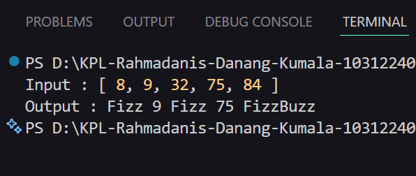

# Tugas Pendahuluan

**Nama:** Rahmadanis Danang Kumala 

**NIM:** 101322400066

**Kelas:** SE-08-01 

## Tugas 
Buatlah sebuah fungsi bernama fizzBuzz yang menerima input larik (array) dan mengembalikan deretan bilangan dan "Fizz" untuk kelipatan 2, "Buzz" untuk kelipatan 7, dan "FizzBuzz" untuk kelipatan 14. Beri nama berkas program sebagai tm.js dan taruh di direktori TM.

## Program/Kode 
Terdapat di [test.js](./test.js) dan [tm.js](./tm.js)

## Output 
 

## Deskripsi
1. File [test.js](./test.js)

Digunakan untuk menguji fungsi `fizzBuzz` dari file `tm.js`. Pada file ini dibuat data input berupa array angka yang kemudian diproses oleh fungsi tersebut dan hasilnya ditampilkan ke console.

2. File [tm.js](./tm.js)

Berisi fungsi utama bernama `fizzBuzz` yang digunakan untuk memproses sebuah array angka. Fungsi ini melakukan pengecekan kondisi menggunakan operasi modulus untuk menentukan apakah angka akan menghasilkan "Fizz", "Buzz", "FizzBuzz", atau tetap menampilkan angka tersebut.

