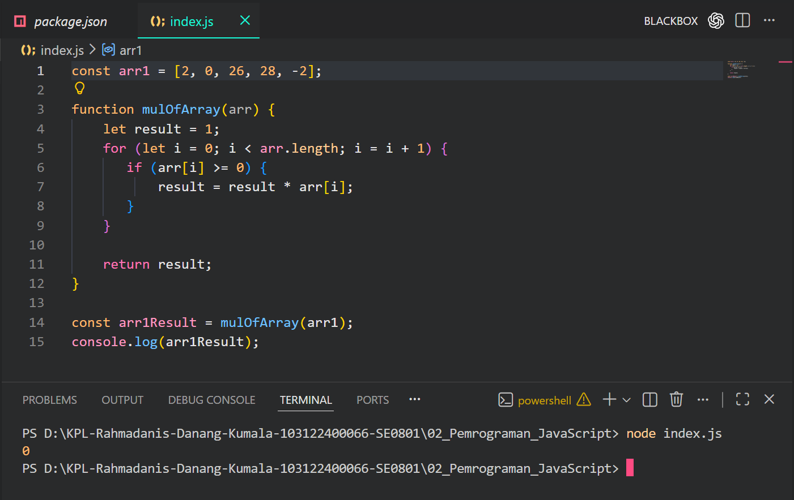
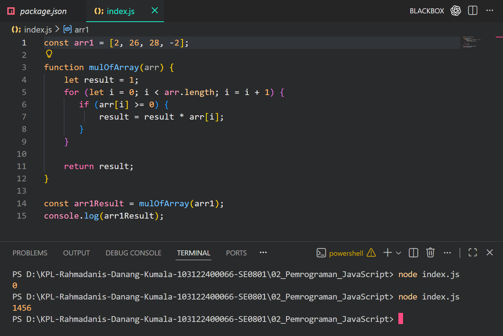

# Tugas Pendahuluan

**Nama:** Rahmadanis Danang Kumala 

**NIM:** 101322400066

**Kelas:** SE-08-01 

## Tugas 
Buatlah program JavaScript untuk mengalikan semua elemen dalam sebuah array yang memiliki nilai lebih besar atau sama dengan 0. Jika terdapat angka negatif, maka angka tersebut tidak ikut dikalikan.

## Program/Kode 
Terdapat di [index.js](./index.js.js)

## Output 
Sebelum Diperbaiki :

Setelah Diperbaiki : 

## Deskripsi

Program ini bertujuan untuk menghitung hasil perkalian dari semua elemen array yang bernilai lebih besar atau sama dengan nol.
Langkah kerja program:

1. Membuat array yang berisi beberapa angka.

2. Membuat fungsi mulOfArray() untuk menghitung perkalian elemen array.

3. Variabel result diberi nilai awal 1 agar bisa digunakan dalam proses perkalian.

4. Menggunakan perulangan for untuk membaca setiap elemen array.

5. Menggunakan if untuk mengecek apakah nilai elemen array lebih besar atau sama dengan 0.

6. Jika memenuhi kondisi, maka nilai tersebut dikalikan dengan result.

7. Setelah semua elemen diproses, fungsi mengembalikan nilai result.