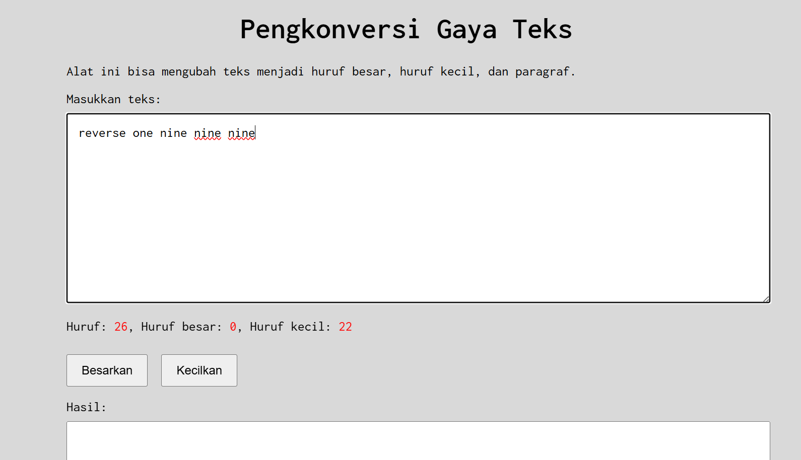
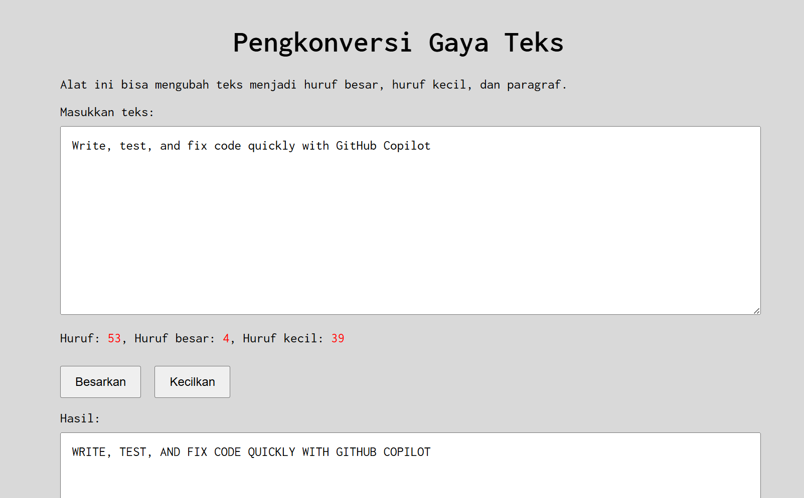
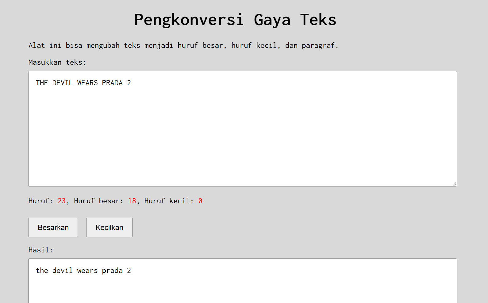

# Tugas Mandiri Modul 03

**Nama:** Rahmadanis Danang Kumala 

**NIM:** 101322400066

**Kelas:** SE-08-01 

## Tugas 
Menghitung Huruf Kecil dan Konversi Huruf pada Teks

## Program/Kode 
Terdapat di [index1.html](./index1.html) , [index1.css](./index1.css) dan [index1.js](./index1.js)

## Output 

## Hitung Huruf Kecil :

## Besarkan Tulisan :

## Kecilkan Tulisan : 

## Deskripsi
1. File [index1.html](./index1.html)
File ini merupakan struktur utama halaman web yang berisi area input teks, tombol untuk mengubah huruf menjadi besar atau kecil, serta area untuk menampilkan hasil konversi teks.

2. File [index1.css](./index1.css)
File ini digunakan untuk mengatur tampilan halaman web seperti font, tata letak container, ukuran textarea, serta styling tombol agar tampilan aplikasi lebih rapi dan mudah digunakan.

3. File [index1.js](./index1.js)
File ini berisi logika program menggunakan JavaScript untuk menghitung jumlah huruf kecil pada teks yang dimasukkan pengguna serta menjalankan fungsi konversi teks menjadi huruf besar dan huruf kecil.