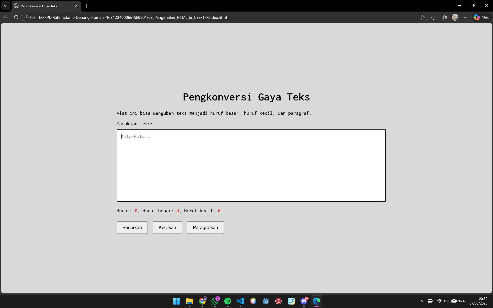

# Tugas Pendahuluan

**Nama:** Rahmadanis Danang Kumala 

**NIM:** 101322400066

**Kelas:** SE-08-01 

## Tugas 
Buatlah Tata Letak Laman Pengkonversi Gaya Teks

## Program/Kode 
Terdapat di [index.html](./index.html) , [index.css](./index.css) dan [index.js](./index.js)

## Output 

## Deskripsi
1. File [index.html](./index.html)
File `index.html` merupakan struktur utama halaman web untuk aplikasi pengkonversi gaya teks. Di dalamnya terdapat textarea untuk memasukkan teks, informasi jumlah huruf, serta beberapa tombol yang digunakan untuk mengubah teks menjadi huruf besar, huruf kecil, atau format paragraf. File ini juga menghubungkan `index.css` untuk tampilan dan `index.js` untuk fungsi interaktif.

2. File [index.css](./index.css)
File `index.js` berisi logika JavaScript yang mengatur interaksi pada halaman. Script ini menangani perubahan teks pada textarea serta menyediakan fungsi untuk mengubah teks menjadi huruf besar (`toUpper()`), huruf kecil (`toLower()`), dan format paragraf atau kapitalisasi awal kata (`toCapitalize()`).

3. File [index.js](./index.js)
File `index.css` digunakan untuk mengatur tampilan halaman web. CSS ini menentukan gaya font, tata letak halaman, ukuran textarea, serta tampilan tombol dan teks sehingga antarmuka aplikasi terlihat lebih rapi dan mudah digunakan.