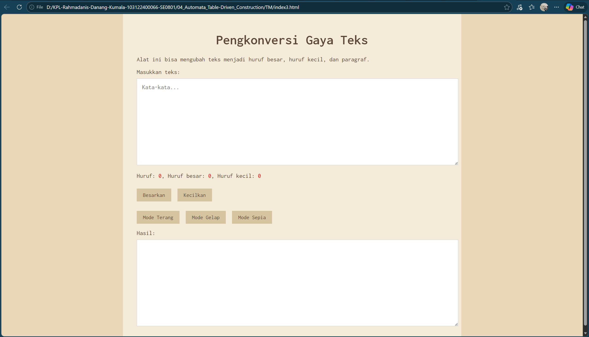

# Tugas Mandiri Modul 04

**Nama:** Rahmadanis Danang Kumala 

**NIM:** 101322400066

**Kelas:** SE-08-01 

## Tugas 
Membangun aplikasi web sederhana berbasis HTML, CSS, dan JavaScript untuk konversi gaya teks serta fitur mode tampilan (terang, gelap, sepia) dengan transisi halus.

## Program/Kode 
Terdapat di [index3.html](./index3.html) , [index3.css](./index3.css) dan [index3.js](./index3.js)

## Output

## Deskripsi
1. File [index3.html](./index3.html)

File ini adalah struktur utama aplikasi web dengan input textarea, tombol konversi teks (besar/kecil), serta opsi mode tampilan: Terang, Gelap, dan Sepia.

2. File [index3.css](./index3.css)

File ini mengatur styling aplikasi, termasuk warna, layout, dan font. Pengaturan tersedia untuk light, dark, dan sepia mode, lengkap dengan efek transisi halus antar mode.

3. File [index3.js](./index3.js)

File JavaScript ini menghitung karakter serta huruf besar/kecil secara real-time, mengonversi teks, dan mengelola mode tampilan melalui manipulasi class pada body.
