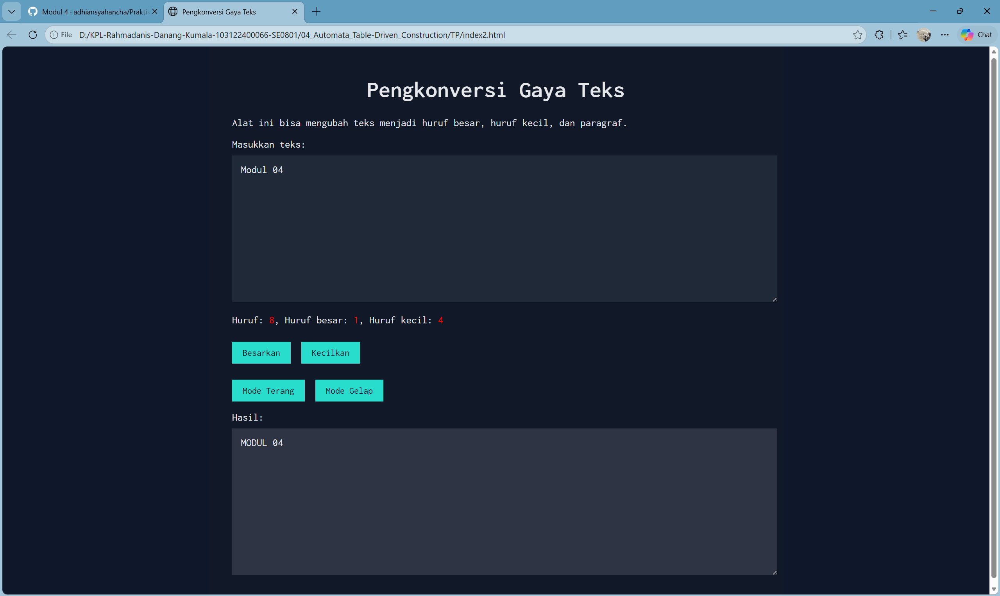

# Tugas Pendahuluan Modul 04

**Nama:** Rahmadanis Danang Kumala 

**NIM:** 101322400066

**Kelas:** SE-08-01 

## Tugas 
Tambahkan mode gelap sekaligus untuk editor-kecil dan tombol-tombolnya. Ketentuan warna untuk latar belakang editor-kecil adalah #2e3443, sementara untuk tombol adalah #29ddcc. Teks untuk tombol tetap mengikuti warna teks sebelumnya. Untuk menghapus pinggiran tombol, nyatakan properti border untuk tidak ditunjukkan.

## Program/Kode 
Terdapat di [index2.html](./index2.html) , [index2.css](./index2.css) dan [index2.js](./index2.js)

## Output

## Deskripsi
1. File [index2.html](./index2.html)

File ini merupakan struktur utama dari program. Di dalamnya terdapat elemen-elemen seperti judul, deskripsi, input teks (textarea), tombol untuk mengubah teks menjadi huruf besar dan kecil, serta tombol untuk mengaktifkan mode terang dan mode gelap. Selain itu, terdapat juga area hasil (editor-kecil) yang digunakan untuk menampilkan hasil konversi teks.

2. File [index2.css](./index2.css)

File ini digunakan untuk mengatur tampilan (styling) dari halaman web. CSS mengatur layout seperti posisi, ukuran, warna, dan font. Selain itu, pada file ini juga ditambahkan fitur mode gelap dengan menggunakan class `.dark-mode`, yang mengubah warna latar belakang, teks, textarea, serta tombol sesuai dengan ketentuan yang diberikan.

3. File [index2.js](./index2.js)

File ini berisi logika atau fungsi dari program. JavaScript digunakan untuk menghitung jumlah huruf, huruf besar, dan huruf kecil secara real-time saat pengguna mengetik. Selain itu, terdapat fungsi untuk mengubah teks menjadi huruf besar (`toUpper`) dan huruf kecil (`toLower`), serta fungsi untuk mengaktifkan mode gelap (`darkMode`) dan kembali ke mode terang (`lightMode`).