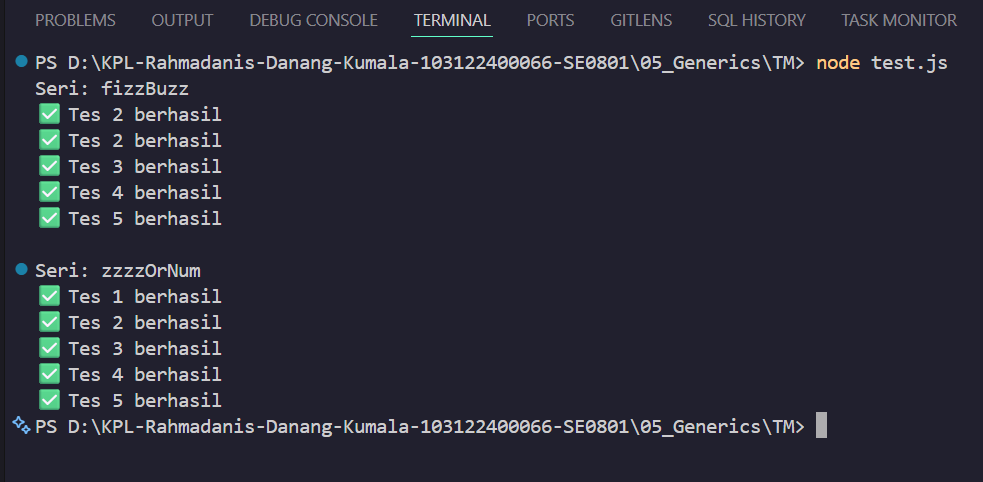

# Tugas Mandiri Modul 06

**Nama:** Rahmadanis Danang Kumala 

**NIM:** 101322400066

**Kelas:** SE-08-01 

## Tugas 
Program FizzBuzz JavaScript ini menggunakan dua fungsi utama: zzzzOrNum dan fizzBuzz. Fungsi zzzzOrNum menentukan apakah angka adalah kelipatan 3, 5, atau keduanya sesuai aturan FizzBuzz, sementara fizzBuzz memproses array angka menggunakan fungsi tersebut. Program ini juga menyertakan validasi input dan JSDoc untuk pengecekan tipe data via tsconfig.json.

## Program/Kode 
Terdapat di [fizz.js](./fizz.js), untuk konfigurasi nya terdapat di [tsconfig.json](./tsconfig.json) dan untuk pengujiannya ada pada [test.js](./test.js)

## Output

## Deskripsi
Program ini mengimplementasikan algoritma FizzBuzz secara modular dengan validasi input. Fungsi `zzzzOrNum` mengubah angka menjadi "Fizz", "Buzz", atau "FizzBuzz" berdasarkan aturan tertentu, dilengkapi validasi tipe data number. Fungsi `fizzBuzz` memproses array dengan memanggil `zzzzOrNum` untuk setiap elemennya. Pengujian melalui `test.js` mencakup skenario normal dan error guna memastikan keandalan program. Berkat JSDoc dan validasi, kode ini terstruktur, aman, dan mudah dipahami.
