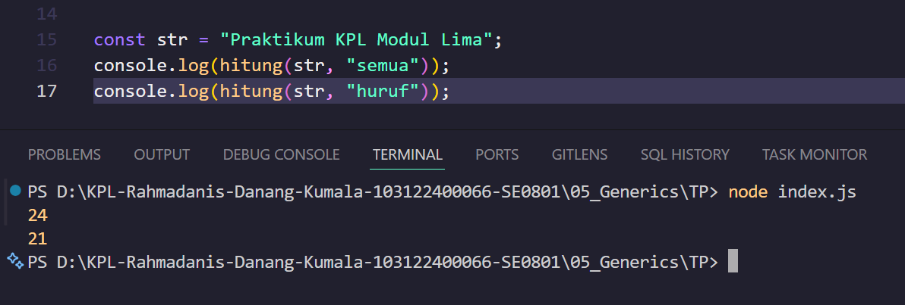

# Tugas Pendahuluan Modul 05

**Nama:** Rahmadanis Danang Kumala 

**NIM:** 101322400066

**Kelas:** SE-08-01 

## Tugas 

Buat fungsi hitung untuk menghitung karakter dalam string berdasarkan mode berikut:
- "semua": seluruh karakter (termasuk spasi).
- "huruf": hanya huruf (tanpa spasi).

Fungsi menerima parameter string dan mode, lalu mengembalikan hasil perhitungannya.

## Program/Kode 
Terdapat di [index.js](./index.js)

## Output

## Deskripsi

Program ini memakai fungsi hitung untuk menjumlahkan karakter string. Cara kerjanya mengulang tiap karakter dengan ketentuan:
- Mode `"semua"`: menghitung seluruh karakter
- Mode `"huruf"`: mengabaikan spasi

Output numerik dapat ditampilkan via `console.log`. Contoh string `"Praktikum KPL Modul Lima"` menghasilkan:
- 24 karakter (semua)
- 21 karakter (tanpa spasi)
