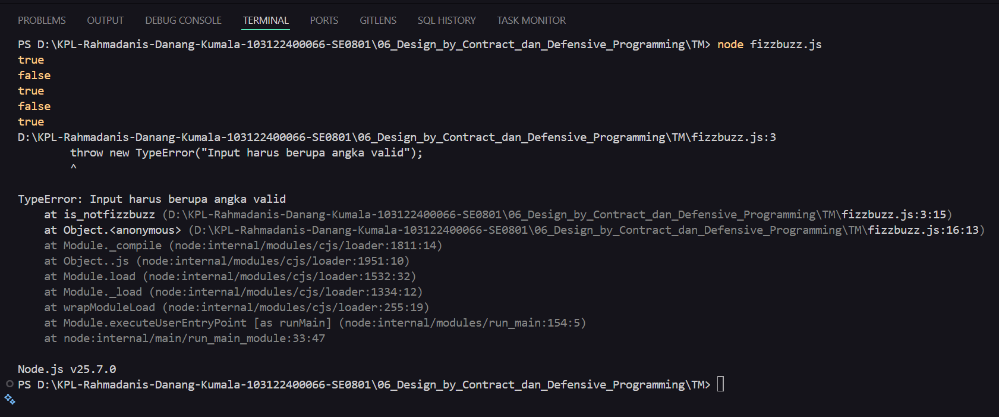

# Tugas Pendahuluan Modul 05

**Nama:** Rahmadanis Danang Kumala 

**NIM:** 101322400066

**Kelas:** SE-08-01 

## Tugas 
Membuat sebuah fungsi is_not_fizzbuzz(number) yang bertujuan untuk:
- Mengembalikan nilai false jika input merupakan kelipatan 3, 5, atau 15 (fizzbuzz)
- Mengembalikan nilai true jika input bukan kelipatan 3 atau 5
- Melempar TypeError jika input bukan bilangan valid seperti null, NaN, Infinity, atau tipe data selain number

## Program/Kode 
Terdapat di [fizzbuzz.js](./fizzbuzz.js)

## Output

## Deskripsi
Program ini memvalidasi bilangan berdasarkan aturan FizzBuzz. Fungsi is_not_fizzbuzz(number) bekerja dengan:
1. Memvalidasi angka menggunakan typeof dan Number.isFinite. Jika tidak valid, dilempar TypeError.
2. Mengecek pembagi: jika habis dibagi 3 atau 5, mengembalikan false.
3. Jika tidak, mengembalikan true.

Fungsi ini memastikan hanya nilai non-fizzbuzz yang bernilai true.
