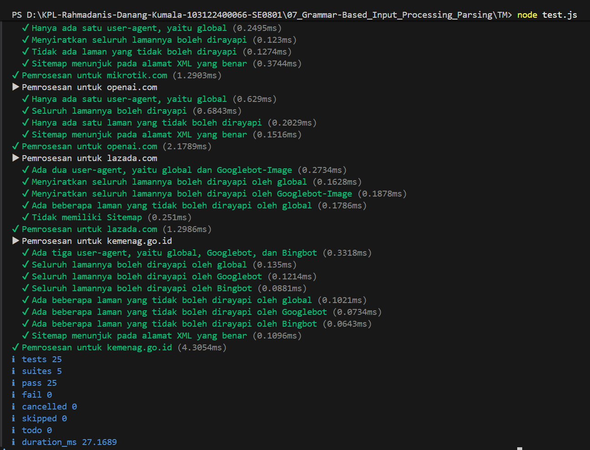

# Tugas Pendahuluan Modul 07

**Nama:** Rahmadanis Danang Kumala 

**NIM:** 101322400066

**Kelas:** SE-08-01 

## Tugas 
Parser `Robots.txt` ke JavaScript Object

## Program/Kode 
Terdapat di [index.js](./index.js), [structure.d.ts](./structure.d.ts), dan [test.js](./test.js)

## Output

## Deskripsi
Tugas ini melibatkan pembuatan fungsi `parseRobots` untuk mengonversi berkas `robots.txt` menjadi POJO sesuai `structure.d.ts`.  

Fungsi menggunakan state-based parsing baris per baris untuk memetakan directive Allow dan Disallow ke User-agent yang aktif.

Hasil parsing meliputi:
- agents: daftar user-agent beserta aturannya
- Sitemap: array URL sitemap
- Host: alamat host 

Fitur tambahan mencakup pengabaian komentar/baris kosong, normalisasi nama user-agent (case-insensitive), pembersihan nilai kosong, serta dukungan multi-agent dan multi-sitemap.

Pengujian via `test.js` pada berbagai situs (Brave, OpenAI, Lazada, dll.) berhasil tanpa error sesuai spesifikasi.