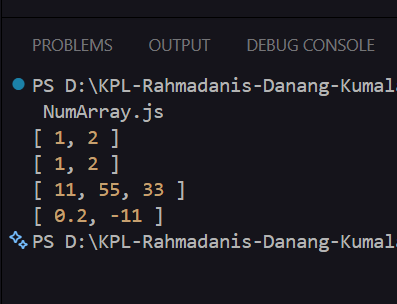

# Tugas Pendahuluan Modul 07

**Nama:** Rahmadanis Danang Kumala 

**NIM:** 101322400066

**Kelas:** SE-08-01 

## Tugas 
Program ini mengonversi string atau array string menjadi array angka.
Cara kerja fungsi toNumberArray(number):
1. Input string dipecah dengan split(","), sedangkan array langsung diproses.
2. Elemen dikonversi menggunakan parseFloat().
3. Hasil NaN dibuang melalui filter().

Fungsi ini menangani spasi, desimal, bilangan negatif, dan mengabaikan nilai tidak valid secara otomatis. Hasil akhirnya adalah array angka yang bersih untuk penggunaan lanjut.

## Program/Kode 
Terdapat di [asersi.js](./.NumArray.js)

## Output

## Deskripsi
Membuat sebuah fungsi toNumberArray(number) yang bertujuan untuk mengubah deretan angka bertipe string menjadi larik (array) angka.
Fungsi harus dapat :
- Menerima input berupa string (dipisahkan koma) atau array of string
- Mengubah setiap elemen menjadi tipe number
- Mengabaikan nilai yang tidak dapat dikonversi menjadi angka (misalnya "abc")