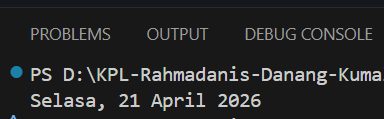

# Tugas Pendahuluan Modul 08

**Nama:** Rahmadanis Danang Kumala 

**NIM:** 101322400066

**Kelas:** SE-08-01 

## Tugas 
Menampilkan tanggal saat ini dengan format :
`Hari, Tanggal, Bulan, Tahun`
menggunakan `Intl.DateTimeFormat`

## Program/Kode 
Terdapat di [index.js](./index.js)

## Output

## Deskripsi
Program ini menampilkan tanggal saat ini dalam format bahasa Indonesia menggunakan fitur Intl pada JavaScript.

Melalui objek `Date` dan `Intl.DateTimeFormat` dengan locale id-ID, waktu diatur sesuai standar Indonesia. 
Properti yang diterapkan meliputi:
- weekday: 'long' (nama hari lengkap)
- day: 'numeric' (tanggal)
- month: 'long' (nama bulan lengkap)
- year: 'numeric' (tahun)

Metode `.format()` menghasilkan string dinamis yang selalu diperbarui sesuai waktu eksekusi.