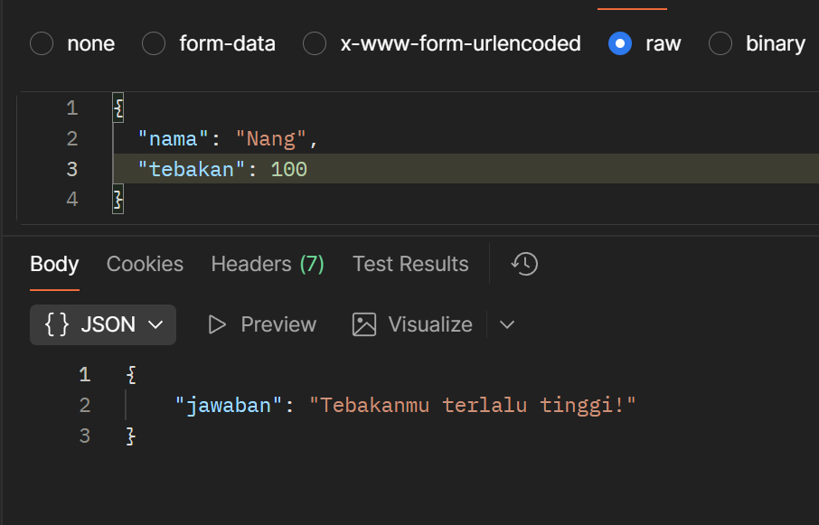
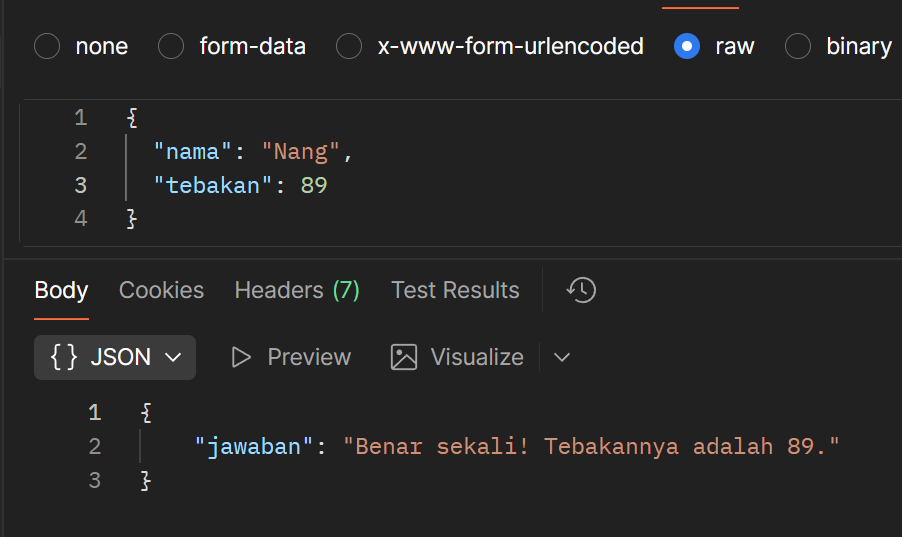

# Tugas Mandiri Modul 09
**Nama:** Rahmadanis Danang Kumala 

**NIM:** 101322400066

**Kelas:** SE-08-01 

## Tugas 
Di TM kamu diminta membuat API tebak angka menggunakan:

```POST /```

Dengan aturan:
1. Angka harus tetap untuk setiap nama
2. Rentang 1–100
3. Huruf besar kecil berpengaruh
4. Tidak boleh pakai library tambahan

## Program/Kode 
Terdapat di [index.js](./index.js)

## Output
Output False 1 :


Output False 2 :


Output True :


## Deskripsi
API Node.js dan Express ini menyediakan tebak angka melalui endpoint POST /. Angka target (1–100) ditentukan konsisten dari nama pengguna via charCodeAt(), dengan validasi tebakan apakah benar, terlalu tinggi, atau rendah.