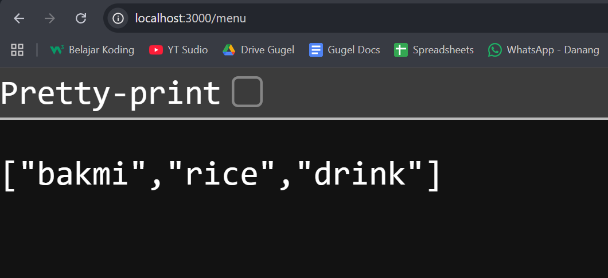
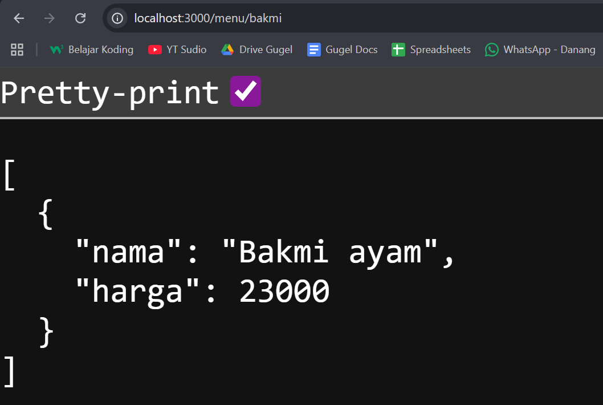
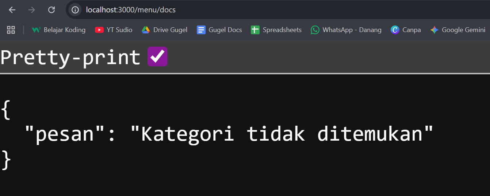

# Tugas Pendahuluan Modul 09
**Nama:** Rahmadanis Danang Kumala 

**NIM:** 101322400066

**Kelas:** SE-08-01 

## Tugas 
Membuat satu endpoint baru beserta dokumentasi OpenAPI-nya yaitu:
GET /menu

## Program/Kode 
Terdapat di [index.js](./index.js)

## Output
Output Pertama :

Output Kedua :

Output Ketiga :

## Deskripsi
Program dibuat menggunakan Express.js dan Swagger/OpenAPI. API memiliki endpoint `GET /menu` untuk menampilkan seluruh kategori menu dan `GET /menu/:category` untuk menampilkan menu berdasarkan kategori tertentu. Dokumentasi API dapat diakses melalui Swagger.