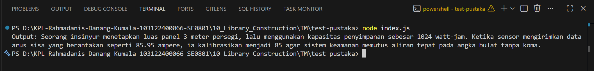

# Tugas Mandiri Modul 10
**Nama:** Rahmadanis Danang Kumala  

**NIM:** 101322400066

**Kelas:** SE-08-01  

## Tugas
Membuat pustaka JavaScript sederhana bernama `mtk-gampang` yang berisi fungsi matematika dasar seperti pangkat, pembulatan bilangan, dan akar kuadrat. Pustaka kemudian diinstal secara lokal pada proyek lain dan digunakan melalui `index.js`.

## Program/Kode
Terdapat di [index.js](./index.js) --> `test-pustaka`

## Output

## Deskripsi
Program menggunakan pustaka lokal bernama `libr` yang dibuat sendiri menggunakan JavaScript ES Module.  
Pustaka memiliki tiga fungsi utama:

- `pangkat(x, y)` → menghitung perpangkatan.
- `bulat(x)` → membulatkan bilangan desimal menjadi bilangan bulat.
- `kuadrat(x)` → menghitung akar kuadrat.

Library diakses melalui `index.js` utama dan berhasil digunakan pada proyek lain menggunakan `npm install` lokal.