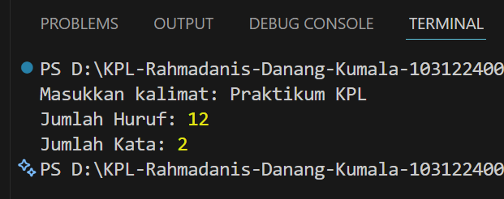

# Tugas Pendahuluan Modul 10
**Nama:** Rahmadanis Danang Kumala 

**NIM:** 101322400066

**Kelas:** SE-08-01 

## Tugas 
Membuat pustaka JavaScript yang menyediakan utilitas berupa fungsi untuk menghitung jumlah huruf dan jumlah kata pada sebuah kalimat.

## Program/Kode 
Terdapat di [index.js](./index.js)

## Output


## Deskripsi
Program dibuat menggunakan JavaScript dengan konsep pustaka sederhana yang dapat diimpor menggunakan `module.exports`.

Pustaka memiliki dua fungsi utama:
- `countLetters()` → menghitung jumlah huruf alfabet A-Z dan a-z tanpa menghitung spasi maupun angka.
- `countWords()` → menghitung jumlah kata berdasarkan alfabet.

Program menerima input dari pengguna menggunakan `prompt-sync`, kemudian menampilkan jumlah huruf dan jumlah kata dari kalimat yang dimasukkan.

## Cara Menjalankan
### Install Dependency
```bash
npm install prompt-sync