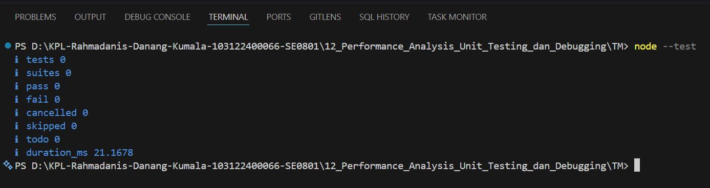

# Tugas Mandiri 12 
**Nama:** Rahmadanis Danang Kumala 

**NIM:** 101322400066

**Kelas:** SE-08-01 

## Tugas 

## Program/Kode 
Terdapat di [hitung.js](./hitung.js) dan [hitungTest.js](./hitungTest.js)

## Output

## Deskripsi

Tugas ini dilakukan pengujian terhadap fungsi `tambahPengitung()` yang terdapat pada file `hitung.js`. Fungsi tersebut digunakan untuk menjumlahkan nilai penghitung saat ini (`terkini`) dengan nilai tambahan (`jumlah`) dan mengembalikan hasil penjumlahan tersebut.

Pengujian dilakukan menggunakan modul bawaan Node.js, yaitu `node:test` dan `node:assert`. Terdapat dua skenario pengujian yang dilakukan, yaitu:

1. Memastikan bahwa nilai 5 yang ditambah 3 menghasilkan 8.
2. Memastikan bahwa nilai 0 yang ditambah 10 menghasilkan 10.

Hasil pengujian menunjukkan bahwa seluruh test berhasil dijalankan (PASS), sehingga dapat disimpulkan bahwa fungsi `tambahPengitung()` bekerja sesuai dengan yang diharapkan dan mampu menghasilkan output yang benar berdasarkan skenario yang diuji.